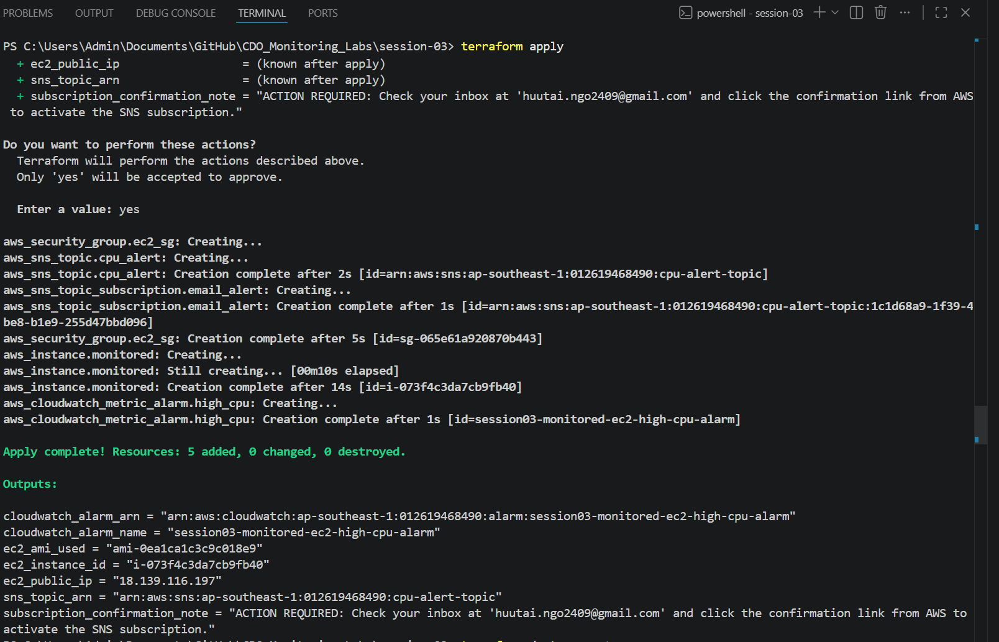
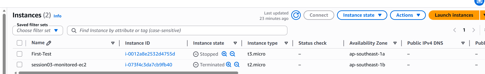
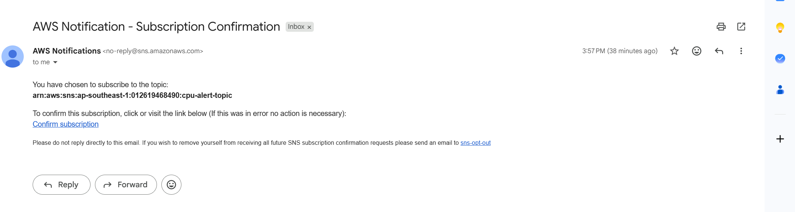
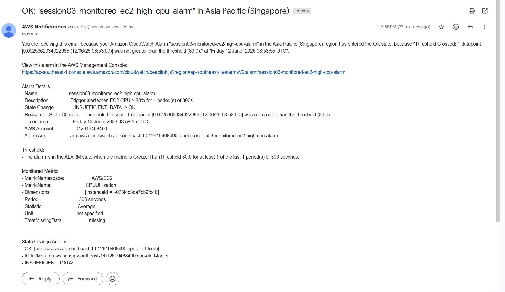

# Lab Evidence — Session 03: CloudWatch Alarm → Email Alert via SNS

**Họ tên:** <!-- Điền tên của bạn -->  
**Ngày thực hiện:** <!-- Điền ngày -->  
**AWS Account ID:** <!-- Điền Account ID -->  
**AWS Region:** ap-southeast-1  

---

## 1. Terraform Apply — Resources Created

> Chụp màn hình terminal sau khi `terraform apply` hoàn thành thành công.  
> Cần thấy: `Apply complete! Resources: 5 added, 0 changed, 0 destroyed.` và phần Outputs.

<!-- 📸 SCREENSHOT: Terminal output of "terraform apply" -->

---

## 2. EC2 Instance — Running

> Vào **EC2 Console → Instances**, chụp màn hình instance `session03-monitored-ec2` đang ở trạng thái **Running**.  
> Cần thấy: Instance ID, Instance state = Running, Instance type = t2.micro.

---

---

## 3. SNS Subscription — Confirmed

> Vào **SNS → Topics → cpu-alert-topic → Subscriptions**, chụp màn hình subscription với Status = **Confirmed**.  
> ⚠️ Nếu vẫn là "PendingConfirmation" → kiểm tra email và click confirm trước.

---

## 4. CloudWatch Alarm — Created

---

## 5. Email Alert Received (Bonus — nếu test stress)

> Nếu đã bật `enable_stress_test = true`, chụp màn hình email nhận được từ AWS khi alarm trigger.  
> Cần thấy: Subject chứa "ALARM", nội dung có Instance ID và metric CPUUtilization.

---
